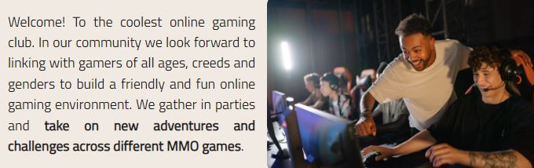
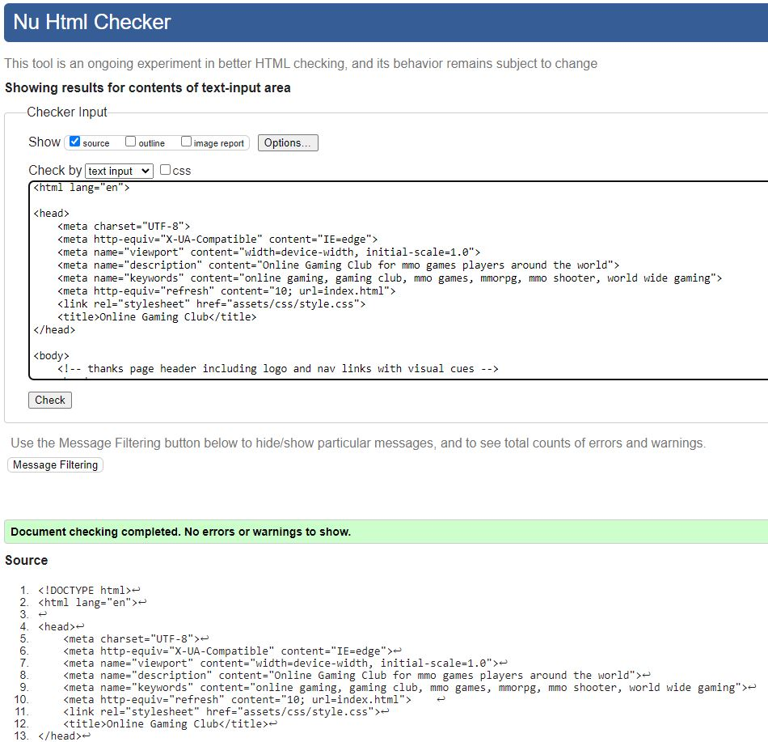
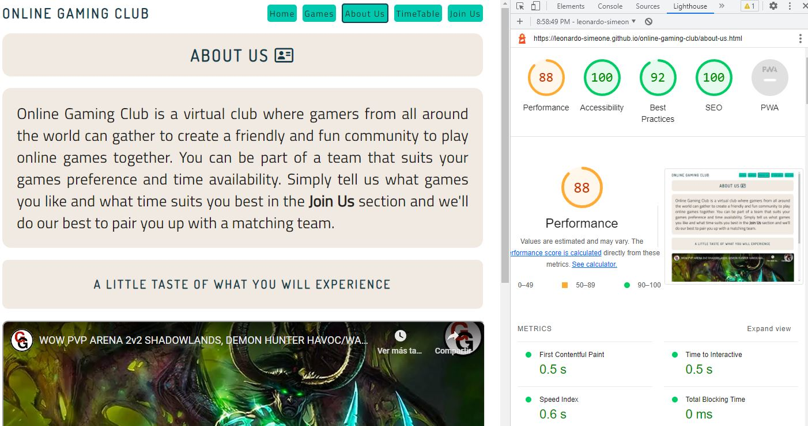

# ONLINE GAMING CLUB

Online Gaming Club is a website that seeks to provide a service based on the needs and wants of online video gamers around the world, that would like to join a community where they can enjoy comradery while playing MMO video games they like and in the regions and times that suit them. Gamers quite often find themselves strugling to coordinate times with their own gaming partners, such as their own friends and family given that life gets in the way, whether it's work, school or extra curricular activities, more often than not, one or several things happen to be keeping players from virtually gathering in groups and game away.

Online Gaming Club offers a selection of different MMO video games to choose from, as well as a variety of servers and times from which users can pick and choose according to their own individual needs. Also the user can find a showcase of images and video that motivate online video gamers to join the club. Once a user has selected their preferences and fully filled out the form provided then they will be assigned to a gaming team accordingly.


## UX

### Wireframing

To wireframe the website I used [Whimsical](https://whimsical.com/wireframes).


### Fonts and Colors Selection

* __Fonts.__

    * Since the google fonts page feature for fonts pairing suggestions was discontinued, I used an alternative tool available to select the fonts for the site.
    * I browsed [heyreliable](https://heyreliable.com/ultimate-google-font-pairings/) google fonts pairings available in their collection and selected number 31 based on the look and mood wanted for the website.

    

    * These two fonts are clear to read and also have a friendly yet professional style which is compatible with a website related to video gaming.

* __Colors.__

    * To select the colors, I used the [ColorSpace](https://mycolor.space/) website which provides the option to input any color you want and then it will provide a selection of matching/compatible colors that relate well to that "base" color you selected in the first place.
    * Once I had my base color selected which is [#222219](https://mycolor.space/?hex=%23222219&sub=1), I used ColorSpace and it gave me a wide variety of compatible colors to work with from which I chose several of them and referenced them accordingly in the css style sheet.    

    

## Features

* __Navigation Bar__

    * The navegation bar is located at the top of the screen and it's centered both vertically and horizontally. It has the logo or club name: ONLINE GAMING CLUB on the left side and the navigation links on the right side.
    * The logo in any of the pages links back to home as well as the navegation link: Home, and the rest of the navigation links: Games, About Us, TimeTable and Join Us link to different pages of the same site.
    * The navigation bar was designed to make it easy to read and with a combination of colors that are easy to the eye and create good contrast.
    * All links in the navigation menu have visual cues regarding where the user currently is on the site, as well as which links are they about to click on, making it easier to navigate.
    * The navegation menu is identical across all the pages on the site which provides quick navigation learning.


* __Home Page Hero Image__

    * The hero image was carefully selected to create a sense of enjoyment related to video gaming and at the same time to try and pass a message to the first time user: "we are waiting for you, join in!"
    * Hovering on top of the hero image is an overlay which provides a brief concept as to what the ONLINE GAMING CLUB is about.


* __Welcome Section__

    * In the welcome section, the user is officially introduced to the site with a compact summary of the site's main purpose and benefits.
    * This section is accompanied by an image that transmits a happy and enjoyable environment for video gamers.



* __Games We Play Section__

    * In the games we play section, the user can see right off the bat, which games are currently being played in the club.
    * This section also offers a brief description of each game as well as an image relevant to the game, mainly their logo.


* __Footer__

    * The footer comprises a simple paragraph with a call to action and an unordered list with all the social media links for the site.
    * The footer the same as the navegation bar is the same across all pages on the site to allow for easy navigation and simetry across the website.
    


* __About Us__

    * In the About Us page, a more comprehensive explanation of the ONLINE GAMING CLUB is delivered in a compact paragraph, letting the user know what the club offers to make their gaming experience more enjoyable and team fun oriented and also where in the site they can join the club and how to do it.
    * Also in this section an iframe was included featuring a team up fighting arena in World of Warcraft, by including this iframe, the user has the option to see what they could avail of should they decide to join.


* __TimeTable__

    * The TimeTable page was designed to inform the user what servers and time frames are the games in the club played in.
    * This timetable indicates the user in detail how, the games, days, times and servers are structured in the gaming groups already formed.
    * It also informs the user that all times are based on IST (irish standard time).    


IST Notification:


* __Join Us__

    * In the Join Us page, the user will find a form that they can fill out to join the club.
    * The form contains sub-sections which cover the user's full name, email address, which days and times the user is available to play as well as which games and servers the user prefers to play in.
    * The form was designed to be inviting and an image refering to video gaming technology was used as the form background to complement this approach.
    * The submit and reset input types, feature visual cues to let the user know they are about to click/tap the element.


## Testing

### Responsiveness

* The first thing I manually tested numerous times was responsiveness down to 320px wide, utilizing Chrome as the main browser, I made sure that the site adapts well for different screen sizes. I used devtools not only for the developing process but also for the screen size testing.


* The [Am I Responsive](https://ui.dev/amiresponsive?url=https://leonardo-simeone.github.io/online-gaming-club/index.html) website was used as well to test responsiveness.


### Functionality

* I also tested effectiveness and efficiency in the links available in the website, I made sure that all links work as intended and that the user can navigate and find information in the site easily.


* I made sure that in the case that the user fails to input necessary information in the form, a relevant message shows indicating what the missing information is.


### Browsers Compatibility

* I tested compatibility and functionality across different browsers. I used Chrome, Edge and Firefox, and in every single one of them the website works and responds well.


### Bugs

* The first issue that I solved was a warning from W3C html checker, indicating that a section did not have a heading. I had placed the heading outside of the section, to solve this I included the heading inside of the section.


* The second issue I found while testing with the lighthouse tool was that the performance indicator on the homepage for mobile was too low.


When I researched in [css-tricks.com](https://css-tricks.com/improve-largest-contentful-paint-lcp-on-your-website-with-ease/) the posible reason behind this occurence, I found out that the images I used were too heavy. I decided to compress the jpg files into smaller jpg files using [tinypng.com](https://tinypng.com/) and then I converted the smaller jpg images into webp files using [cloudconvert.com](https://cloudconvert.com/) which in turn made them even smaller without losing display quality. The performance indicator improved significantly.


* The third issue I encountered was making the iframe responsive. I reasearched about "how to make a video iframe responsive" and I found in [css-tricks.com](https://css-tricks.com/fluid-width-video/) a snippet of code which I copied and adapted to my needs to resolve the issue.


* The fourth issue to resolve, was the need to alert the user that at least one checkbox for each group has to be checked for the form to be submitted. I researched and realized that by using html and css only, this task was not achievable. The use of a jQuery was necessary, so I found [this block of code](https://www.allphptricks.com/submit-form-atleast-one-checkbox-checked/) which I copied and adapted to each one of the checkboxes groups in the form.

```js
$(document).ready(function(){
    $("form").submit(function(){
        if ($('#days .checkboxes div input:checkbox').filter(':checked').length < 1 || $('#game .checkboxes div input:checkbox').filter(':checked').length < 1 || $('#time .checkboxes div input:checkbox').filter(':checked').length < 1){
        alert("Check at least one box on each section!");
        return false;
        }
    });
});
```

* The fifth and last issue I fixed, was the fact that the form submit and reset inputs were not working. I realized after looking for information on Slack, that I had put the three groups of checkboxes plus the First Name, Last Name and Email group in four different form elements. To resolve this issue I changed the form elements for divs and enclosed all groups in the one form.


### Form Data Verification

* In order to make the website more user friendly, I created a thanks page to which the user is brought once the form has been filled out and submitted. From this page the user can wait to be redirected to the home page or navigate to a preffered page manually.
* Based on the fact that this a front-end only type of website, the information is not being processed in any shape or form however, I wanted to test that before the thanks page implementation, the form was working correctly by sending the data to the Code Institute form dump site utilizing the post method.


### HTML, CSS and Accessibility Validators Testing

* I used the [official W3C Markup Validation Service](https://validator.w3.org/#validate_by_input) on all the html files and no errors were found.

__Index__


__About Us__


__Timetable__


__Join Us__


__Thanks__



* I ran the css file through the [official W3C Jigsaw validator](https://jigsaw.w3.org/css-validator/#validate_by_input) and no issues were found.


* I used the lighthouse tool in devtools on each page for mobile and desktop to test color contrast and accessibility and they were marked 100%, except for the thanks page, which was marked 90%.

 #### Mobile:
    
__Index__


__About Us__


__Timetable__


__Join Us__


__Thanks__


#### Desktop:

__Index__


__About Us__



__Timetable__


__Join Us__


__Thanks__

